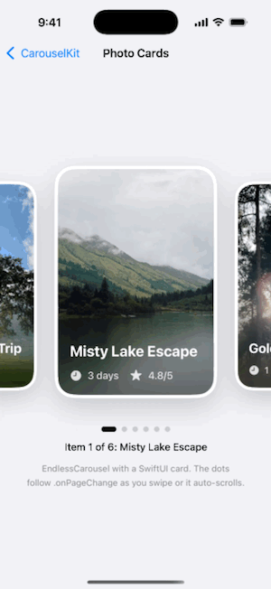
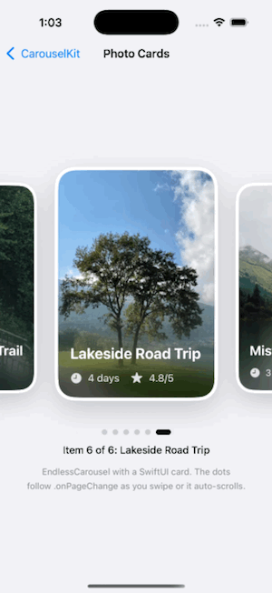
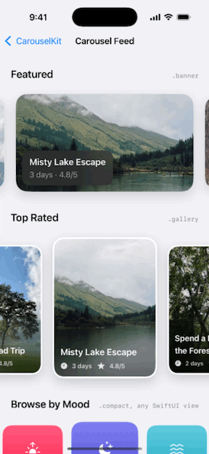
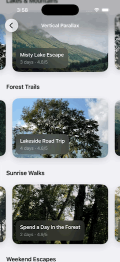

# CarouselKit

[](https://www.swift.org)
[](https://github.com/babinraj5/CarouselKit/tags)
[](#installation)
[](#installation)
[](#swiftui)
[](#installation)
[](https://www.swift.org/migration/documentation/swift-6-concurrency-migration-guide/)
[](Package.swift)

An endless, auto-scrolling card carousel for SwiftUI and UIKit.

| SwiftUI photo cards | Parallax while dragging | Feed with presets | UIKit custom views |
|:---:|:---:|:---:|:---:|
|  |  |  |  |
| Auto-scroll, page dots via `.onPageChange` | The photo drifts inside its card | Three carousels, three configurations | `EndlessCarouselView` with your own `UIView`s |

- Loops forever in both directions and snaps one card per swipe
- Side cards shrink slightly; the centered card stands out
- Optional auto-scroll, plus horizontal and vertical parallax for images
- Tells you which card is showing, for page dots or analytics

**Made with Swift 6**, with full data-race safety checks turned on. **Requires** iOS 17+ (or macOS 14+) and Xcode 16+.

---

## Installation

CarouselKit is installed with Swift Package Manager.

### In an Xcode app

1. In Xcode, choose **File → Add Package Dependencies…**
2. Paste this URL into the search field at the top right:

   ```
   https://github.com/babinraj5/CarouselKit.git
   ```

3. Set **Dependency Rule** to **Up to Next Major Version** from `1.0.0`, then click **Add Package**.
4. In the next dialog, check that **CarouselKit** is added to your app target and click **Add Package**.
5. Import it in any file that uses the carousel:

   ```swift
   import CarouselKit
   ```

### In another Swift package

Add CarouselKit to your `Package.swift`:

```swift
dependencies: [
    .package(url: "https://github.com/babinraj5/CarouselKit.git", from: "1.0.0")
],
targets: [
    .target(name: "YourTarget", dependencies: ["CarouselKit"])
]
```

### Updating

To get the latest version, choose **File → Packages → Update to Latest Package Versions** in Xcode. With the rule above you get fixes and new features (`1.x`), but never a breaking `2.0` without choosing it yourself.

### Working on CarouselKit itself

Clone the repo and open `Package.swift` in Xcode to edit the package, or open `Demo/CarouselKitDemo.xcodeproj` to try your changes in the demo app:

```bash
git clone https://github.com/babinraj5/CarouselKit.git
```

To test unreleased changes in your own app, use **File → Add Package Dependencies… → Add Local…** and pick the cloned folder instead of the URL.

---

## SwiftUI

### Basic carousel

Pass any array of `Identifiable` items and build a view for each card:

```swift
EndlessCarousel(places) { place in
    Image(place.imageName)
        .resizable()
        .scaledToFill()
        .clipShape(RoundedRectangle(cornerRadius: 24))
}
```

The carousel sizes the cards for you, so your card view should fill the space it's given.

### Handling taps

Wrap the card in a `Button`:

```swift
EndlessCarousel(places) { place in
    Button { selectedPlace = place } label: {
        PlaceCard(place: place)
    }
    .buttonStyle(.plain)
}
```

### Knowing which card is showing

`.onPageChange` is called whenever a new card slides into the center, including when the carousel first appears:

```swift
EndlessCarousel(places) { place in
    PlaceCard(place: place)
}
.onPageChange { index, place in
    currentPage = index              // 0 ..< places.count
    analytics.log("viewed", place.id)
}
```

### Parallax

Add `.scrollParallax()` to an image so it drifts inside its card while scrolling, as if the card were a window onto the photo.

| Horizontal: swiping the carousel | Vertical: scrolling the page |
|:---:|:---:|
|  |  |

The card must clip the image:

```swift
EndlessCarousel(places) { place in
    Color.clear
        .overlay {
            Image(place.imageName)
                .resizable()
                .scaledToFill()
                .scrollParallax(amount: 40)   // 20 is subtle, 60 is strong
        }
        .clipShape(RoundedRectangle(cornerRadius: 24))
}
```

By default the photo only moves while the carousel is swiped. When carousels are stacked in a vertical `ScrollView`, add `.vertical` so photos also drift as the page scrolls:

```swift
.scrollParallax(amount: 30, axes: [.horizontal, .vertical])
```

Use `axes: .vertical` on its own for images in an ordinary vertical scroll view, such as a header photo.

---

## Configuration

Every setting has a default, so only pass the ones you want to change:

```swift
EndlessCarousel(places, configuration: CarouselConfiguration(
    cardWidthRatio: 0.75,
    autoScrollInterval: nil   // turn off auto-scroll
)) { place in
    PlaceCard(place: place)
}
```

| Setting | Default | What it does |
|---|---|---|
| `cardWidthRatio` | `0.6` | Card width as a share of the carousel width |
| `cardAspectRatio` | `1.43` | Card height ÷ width (above 1 = portrait, below 1 = landscape) |
| `spacing` | `14` | Gap between cards |
| `inactiveScale` | `0.9` | Size of side cards (`1` = no shrinking) |
| `inactiveOffsetY` | `6` | How far side cards move down (`0` = none) |
| `verticalInset` | `30` | Space above and below the cards for shadows |
| `autoScrollInterval` | `.seconds(3)` | Time between auto slides (`nil` = off) |
| `autoScrollAnimation` | `.smooth(duration: 1.0)` | Animation for auto slides |

The carousel's height is worked out from these settings, so you don't need to set it.

To reuse a setup across screens, make it a preset:

```swift
extension CarouselConfiguration {
    static let banner = CarouselConfiguration(cardWidthRatio: 0.85, cardAspectRatio: 0.55)
}

EndlessCarousel(promos, configuration: .banner) { promo in PromoCard(promo: promo) }
```

---

## UIKit

`EndlessCarouselView` is a regular `UIView` with the same features.

### Basic carousel

```swift
let carousel = EndlessCarouselView(items: trips) { trip in
    UIImage(named: trip.imageName)
} foreground: { trip in
    TripLabelView(trip: trip)   // optional view drawn on top of the image
}

carousel.onSelect = { [weak self] trip in
    self?.showDetails(for: trip)
}

carousel.translatesAutoresizingMaskIntoConstraints = false
view.addSubview(carousel)
NSLayoutConstraint.activate([
    carousel.leadingAnchor.constraint(equalTo: view.leadingAnchor),
    carousel.trailingAnchor.constraint(equalTo: view.trailingAnchor),
    carousel.centerYAnchor.constraint(equalTo: view.centerYAnchor)
])
```

Pin only the sides and a vertical position. The view sets its own height.

### Other kinds of cards

```swift
// Any UIView as the card (it gets the parallax effect)
EndlessCarouselView(items: products, background: { product in
    ProductBackgroundView(product: product)
})

// A SwiftUI view as the card
EndlessCarouselView(items: trips) { trip in
    TripCard(trip: trip)
}
```

Card views are display-only. Use `onSelect` for taps.

### Card style

Image and custom-view cards get a white border, rounded corners and a shadow. Change them with `CarouselCardStyle`:

```swift
EndlessCarouselView(
    items: trips,
    style: CarouselCardStyle(cornerRadius: 20, borderWidth: 0, shadowOpacity: 0.1, parallaxAmount: 25)
) { trip in
    UIImage(named: trip.imageName)
}
```

UIKit cards use horizontal parallax. Vertical parallax needs a SwiftUI `ScrollView` around the carousel, so it doesn't react to a `UIScrollView` or `UITableView`.

### Knowing which card is showing

```swift
carousel.onPageChange = { [weak pageControl] index, trip in
    pageControl?.currentPage = index
}
```

`carousel.currentIndex` also holds the index of the centered card.

### Updating

You can change `items`, `configuration`, `onSelect` and `onPageChange` at any time, for example after a network request:

```swift
carousel.items = newTrips
```

In table or collection view cells, create the carousel once per cell and just update `items` when the cell is reused.

---

## Tips

- **Resize large photos.** Images around 1200 px wide scroll smoothly; 3000+ px photos can stutter.
- **Use fixed IDs.** Don't create a new `UUID()` for an item every time you load the data.
- **Empty arrays are fine.** The carousel shows nothing until your data arrives.

---

## Demo app

Open `Demo/CarouselKitDemo.xcodeproj` and run it on a simulator. It shows every SwiftUI and UIKit option in this README.

---

## Running the tests

```bash
swift test
```

Or open `Package.swift` in Xcode and press **⌘U**.
